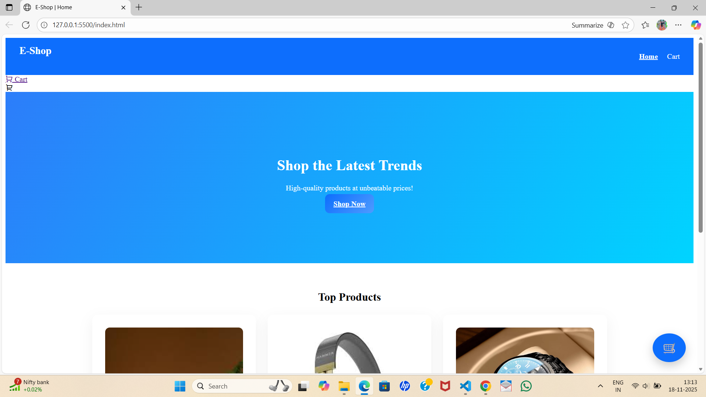
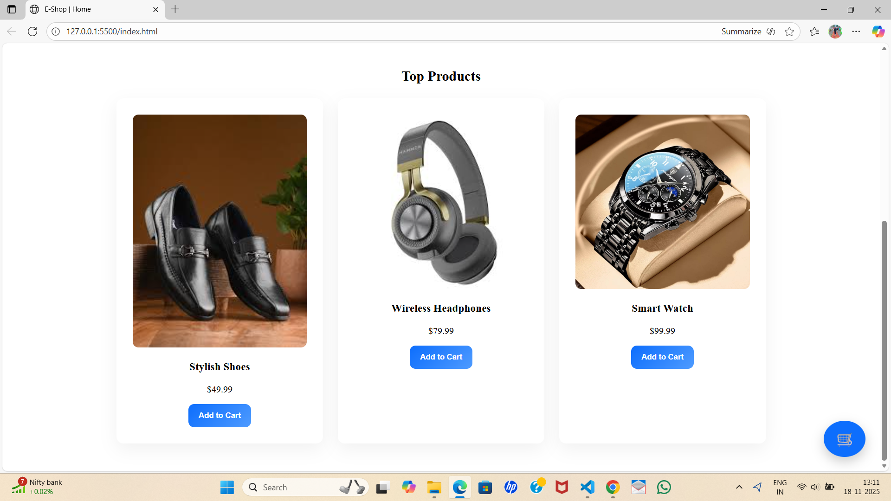

🛍️ EshopProject – Modern E-Commerce Frontend (HTML, CSS, JavaScript)

EshopProject is a clean, responsive, and attractive e-commerce frontend website designed using HTML, CSS, and JavaScript.
This project demonstrates strong UI/UX design skills and showcases a real-world shopping experience layout suitable for resumes and portfolios.

🚀 Features
✅ Modern & Responsive UI

Clean navigation bar

Beautiful hero section

Stylish product cards

Smooth layout and spacing

Image-based product showcase

🛒 E-Commerce Elements

Product grid

Product images

Titles, prices, descriptions

Add-to-cart styled buttons (UI only)

🎨 Custom Styling

Well-structured CSS

Hover effects

Rounded cards

Shadows and spacing

Modern color scheme

🧰 Tech Stack Used
Technology	Purpose
HTML5	Structure of the website
CSS3	Styling, layout, animations
JavaScript	Interactions and dynamic behavior (optional)
📂 Project Structure
EshopProject/
│── index.html
│── products.html
│── styles.css
│── images/
│     ├── homepage.png
│     ├── products.png
│     └── (all product images)

## 📸 Screenshots

### 🏠 Homepage  

### 🛒 Products Page  

▶️ How to Run the Project Locally

Download or clone the repository:

git clone https://github.com/AN-2005/EshopProject.git

Open the project folder:

cd EshopProject

Open index.html in any browser:

Right-click → Open With → Chrome/Edge/Firefox

OR drag the file into your browser

🌐 Live Demo (Optional)

If you want, I’ll help you set up GitHub Pages so your website becomes live like:

👉 https://AN-2005.github.io/EshopProject

Just say “Enable GitHub Pages”.

📌 Future Improvements

Add real shopping cart

Add search/filter system

Add product detail page

Add backend (Java/Spring Boot or Node.js)

Add animations and transitions

Make it fully mobile responsive

👤 Author

Atharva Nimbalkar
Frontend Developer
📧 Email: (atharvanimbalkar0@gmail.com)
🌐 GitHub: https://github.com/AN-2005
Commit
